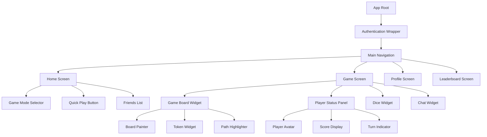
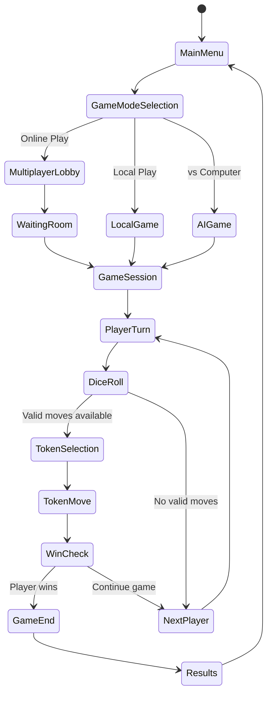

# Ludo Game Mobile App Design Document

## Overview

A cross-platform mobile Ludo game application built with Flutter, offering classic Ludo gameplay with modern features, multiplayer support, and engaging user experience. The app targets both Android and iOS platforms, providing seamless gameplay similar to popular games like Ludo King.

### Key Features
- Classic Ludo gameplay with standard rules
- Online multiplayer (2-4 players)
- Local multiplayer (pass-and-play)
- Single player vs AI
- Real-time game synchronization
- User authentication and profiles
- Leaderboards and achievements
- In-game chat system
- Customizable themes and boards
- Offline mode support

## Technology Stack & Dependencies

### Core Framework
- **Flutter SDK**: 3.16+ for cross-platform development
- **Dart**: 3.2+ programming language

### State Management
- **Riverpod**: For reactive state management
- **Flutter Hooks**: For widget-level state management

### Backend & Networking
- **Firebase Suite**:
  - Authentication (Google, Facebook, Guest)
  - Firestore (real-time database)
  - Cloud Functions (game logic validation)
  - Cloud Messaging (push notifications)
- **Socket.IO Client**: Real-time multiplayer communication
- **HTTP**: RESTful API communication

### UI/UX Libraries
- **Flutter Animate**: Smooth animations and transitions
- **Lottie**: Vector animations
- **Cached Network Image**: Efficient image loading
- **Flutter SVG**: Scalable vector graphics

### Game Development
- **Flame**: 2D game engine for Flutter
- **Flutter Custom Paint**: Custom board rendering
- **Vector Math**: Game calculations and positioning

### Audio
- **Just Audio**: Background music and sound effects
- **Flutter TTS**: Text-to-speech for accessibility

### Storage
- **Shared Preferences**: Local settings storage
- **Hive**: Local database for offline data
- **Path Provider**: File system access

## Component Architecture

### Component Hierarchy



### Core Components

#### 1. Game Board Component
```dart
class GameBoardWidget extends StatefulWidget {
  final GameState gameState;
  final Function(TokenMove) onTokenMove;
  final Function(int) onDiceRoll;
}
```

**Responsibilities**:
- Render the Ludo board using CustomPainter
- Handle touch interactions for token movement
- Display token animations and highlighting
- Show valid move indicators

**State Management**:
- Board dimensions and scaling
- Token positions and animations
- Move validation and highlighting
- Touch gesture recognition

#### 2. Game State Manager
```dart
class GameStateNotifier extends StateNotifier<GameState> {
  // Game logic and state mutations
}
```

**Responsibilities**:
- Manage current game state
- Validate moves according to Ludo rules
- Handle turn management
- Synchronize multiplayer state

#### 3. Multiplayer Service
```dart
class MultiplayerService {
  final SocketIOClient socket;
  final FirebaseFirestore firestore;
}
```

**Responsibilities**:
- Real-time communication with other players
- Game room management
- Player matchmaking
- State synchronization

#### 4. Audio Manager
```dart
class AudioManager {
  final AudioPlayer backgroundPlayer;
  final AudioPlayer sfxPlayer;
}
```

**Responsibilities**:
- Background music control
- Sound effects for game events
- Volume and audio settings management

## Game Architecture

### Game Flow Diagram



### Core Game Logic

#### Ludo Rules Implementation
1. **Board Structure**: 15x15 grid with colored paths
2. **Token Movement**: Clockwise around the board
3. **Starting Rules**: Roll 6 to bring token out of home
4. **Capturing**: Land on opponent's token to send it home
5. **Safe Zones**: Colored squares provide protection
6. **Winning**: All 4 tokens must reach the center

#### Move Validation System
```dart
class MoveValidator {
  static bool isValidMove(Token token, int diceValue, GameState state) {
    // Validate move according to Ludo rules
  }
  
  static List<Position> getPossibleMoves(Player player, int diceValue) {
    // Calculate all valid moves for current player
  }
}
```

## Data Models

### Core Game Models

#### Player Model
```dart
class Player {
  final String id;
  final String name;
  final String avatar;
  final PlayerColor color;
  final List<Token> tokens;
  final int score;
  final bool isCurrentTurn;
}
```

#### Token Model
```dart
class Token {
  final String id;
  final PlayerColor color;
  final Position currentPosition;
  final TokenState state; // home, playing, safe, finished
  final bool isSelected;
}
```

#### Game State Model
```dart
class GameState {
  final String gameId;
  final List<Player> players;
  final Player currentPlayer;
  final int lastDiceRoll;
  final GameStatus status; // waiting, playing, paused, finished
  final int turnTimeLimit;
  final DateTime lastMoveTime;
}
```

#### Position Model
```dart
class Position {
  final int x;
  final int y;
  final PositionType type; // regular, safe, home, finish
  final PlayerColor? ownerColor;
}
```

## Routing & Navigation

### Navigation Structure
```dart
class AppRouter {
  static final GoRouter router = GoRouter(
    routes: [
      GoRoute(
        path: '/',
        builder: (context, state) => const SplashScreen(),
      ),
      GoRoute(
        path: '/auth',
        builder: (context, state) => const AuthScreen(),
      ),
      GoRoute(
        path: '/home',
        builder: (context, state) => const HomeScreen(),
      ),
      GoRoute(
        path: '/game-modes',
        builder: (context, state) => const GameModeScreen(),
      ),
      GoRoute(
        path: '/game/:gameId',
        builder: (context, state) => GameScreen(
          gameId: state.params['gameId']!,
        ),
      ),
      GoRoute(
        path: '/profile',
        builder: (context, state) => const ProfileScreen(),
      ),
    ],
  );
}
```

### Deep Linking Support
- Join game via invitation links
- Share game rooms with friends
- Resume interrupted games

## Styling Strategy

### Design System
- **Color Palette**: Vibrant colors for each player (Red, Blue, Green, Yellow)
- **Typography**: Roboto font family for consistency
- **Spacing**: 8px grid system
- **Animations**: Smooth 300ms transitions

### Theme Configuration
```dart
class AppTheme {
  static ThemeData lightTheme = ThemeData(
    primarySwatch: Colors.blue,
    fontFamily: 'Roboto',
    // Custom color scheme for game elements
  );
  
  static ThemeData darkTheme = ThemeData.dark().copyWith(
    // Dark mode adaptations
  );
}
```

### Responsive Design
- Adaptive layouts for different screen sizes
- Portrait and landscape orientations
- Tablet-optimized layouts

## State Management

### Riverpod Providers Architecture

```dart
// Game State Provider
final gameStateProvider = StateNotifierProvider<GameStateNotifier, GameState>(
  (ref) => GameStateNotifier(ref.read(multiplayerServiceProvider)),
);

// Audio Provider
final audioProvider = Provider<AudioManager>(
  (ref) => AudioManager(),
);

// User Profile Provider
final userProfileProvider = StreamProvider<UserProfile>(
  (ref) => AuthService.userProfileStream,
);

// Leaderboard Provider
final leaderboardProvider = FutureProvider<List<LeaderboardEntry>>(
  (ref) => LeaderboardService.getTopPlayers(),
);
```

### State Flow
1. **Authentication State**: Manages user login/logout
2. **Game State**: Tracks current game progress
3. **UI State**: Controls loading states and navigation
4. **Settings State**: Handles user preferences

## API Integration Layer

### Firebase Integration

#### Authentication Service
```dart
class AuthService {
  static Future<User?> signInWithGoogle() async {
    // Google Sign-In implementation
  }
  
  static Future<User?> signInAsGuest() async {
    // Anonymous authentication
  }
  
  static Stream<User?> get authStateChanges {
    // Listen to auth state changes
  }
}
```

#### Firestore Data Structure
```
/games/{gameId}
  - players: Map<String, Player>
  - currentTurn: String
  - gameState: GameState
  - createdAt: Timestamp
  - lastActivity: Timestamp

/users/{userId}
  - profile: UserProfile
  - stats: GameStats
  - friends: List<String>
  - achievements: List<Achievement>

/leaderboards/global
  - entries: List<LeaderboardEntry>
  - lastUpdated: Timestamp
```

### Real-time Communication
```dart
class SocketService {
  void joinGameRoom(String gameId) {
    socket.emit('join_game', {'gameId': gameId});
  }
  
  void sendMove(TokenMove move) {
    socket.emit('player_move', move.toJson());
  }
  
  void listenToGameEvents() {
    socket.on('game_update', (data) {
      // Update local game state
    });
  }
}
```

## Testing Strategy

### Unit Testing
- Game logic validation
- Move calculation algorithms
- State management functions
- Utility functions

### Widget Testing
- Individual component behavior
- User interaction flows
- Animation testing
- Responsive layout testing

### Integration Testing
- Complete game flow testing
- Multiplayer synchronization
- Firebase integration
- Performance testing

### Test Structure
```dart
group('Game Logic Tests', () {
  test('should validate valid token moves', () {
    // Test move validation
  });
  
  test('should handle token capture correctly', () {
    // Test capture mechanics
  });
  
  testWidgets('should display game board correctly', (tester) async {
    // Test UI rendering
  });
});
```

## Performance Optimization

### Memory Management
- Efficient sprite rendering
- Token pooling for animations
- Proper widget disposal
- Image caching strategies

### Network Optimization
- Delta state updates for multiplayer
- Compression for game state data
- Connection retry mechanisms
- Offline mode handling

### Battery Optimization
- Adaptive frame rates
- Background processing limits
- Efficient animation strategies
- Smart network polling

## Security Considerations

### Game Integrity
- Server-side move validation
- Anti-cheat mechanisms
- Rate limiting for API calls
- Secure random number generation for dice

### Data Protection
- User data encryption
- Secure authentication flows
- Privacy-compliant data handling
- GDPR compliance measures

## Accessibility Features

### Visual Accessibility
- High contrast mode support
- Colorblind-friendly indicators
- Scalable UI elements
- Screen reader compatibility

### Motor Accessibility
- Adjustable touch targets
- Alternative input methods
- Gesture simplification options
- Voice command support

## Monetization Strategy

### Revenue Models
- **Freemium**: Basic game free, premium features paid
- **In-App Purchases**: Themes, avatars, power-ups
- **Advertisement**: Rewarded videos, banner ads
- **Battle Pass**: Seasonal content and rewards

### Premium Features
- Exclusive board themes
- Custom avatars and emotes
- Priority matchmaking
- Ad-free experience
- Advanced statistics